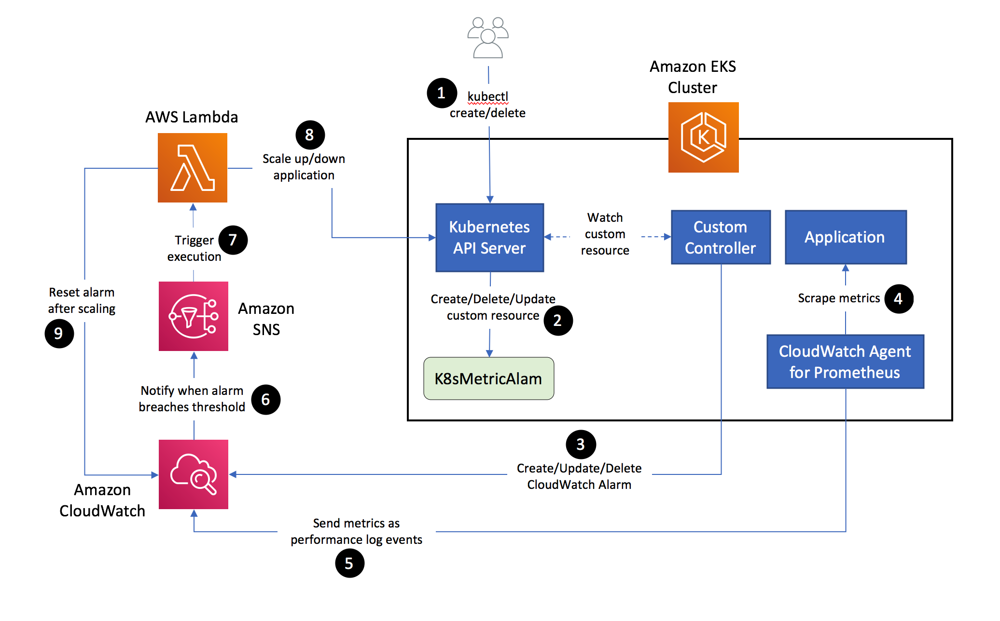

## Autoscaling Kubernetes deployments based on custom Prometheus metrics using CloudWatch Container Insights

This Git repository contains software artifacts that enable autoscaling microservices deployed to an Amazon EKS cluster or a self-managed Kubernetes cluster on AWS, based on custom Prometheus metrics collected from the workloads. It has a custom Kubernetes controller to manage Amazon CloudWatch metric alarms that watch custom metrics data and trigger scaling actions. AWS Lambda is used to autoscale the microservices.

Please refer to this blog post for details about how this works.

## Architecture
The architecture used to implement this autoscaling solution comprises the following elements.

<ul>
<li>
A Kubernetes Operator implemented using Kubernetes Java SDK. This operator packages a custom resource named <i>K8sMetricAlarm</i> defined by a CustomResourceDefinition, a custom controller implemented as a Deployment, which responds to events in the Kubernetes cluster pertaining to add/update/delete actions on the K8sMetricAlarm custom resource, and Role/RoleBinding resources to grant necessary permissions to the custom controller. The customer controller runs under the identity of a Kubernetes service account which is associated with an IAM role that has permissions to manages resources in CloudWatch.
</li>
<li>
<a href="https://docs.aws.amazon.com/AmazonCloudWatch/latest/monitoring/ContainerInsights-Prometheus-Setup.html">CloudWatch agent for Prometheus</a> metrics collection which is installed as a Deployment with a single replica in the Amazon EKS cluster.
</li>
<li>
Amazon CloudWatch metric alarms which are managed by the custom controller in conjunction with the K8sMetricAlarm custom resource.
</li>
<li>
Amazon SNS topic which is configured to receive notifications when a CloudWatch alarm breaches a specified threshold.
</li>
<li>
AWS Lambda function whose execution is triggered when a notification is sent to the Amazon SNS topic. The Lambda function acts as a Kubernetes client and performs the autoscaling operation on the target resource.
</li>
<li>
One or more microservices deployed to the cluster that are the target of autoscaling. These services have been instrumented with Prometheus client library to collect application-specific metrics and expose them over HTTP, to be read by the CloudWatch agent for Prometheus.
</li>
</ul>

## Build & Installation Instructions

First, build the Docker image for the custom controller per instructions <a href="https://github.com/aws-samples/k8s-cloudwatch-operator/blob/main/cloudwatch-controller/README.md">here</a>.

Next, build and deploy the Lambda Kubernetes client per the instructions <a href="https://github.com/aws-samples/k8s-cloudwatch-operator/blob/main/cloudwatch-lambda/README.md">here</a>.

Then, deploy the Kubernetes operator to an Amazon EKS cluster as follows: 
<b>kubectl apply -f operator.yaml</b>

The initial state of <b>aws-auth</b> ConfigMap in the cluster contains the mapping that allows worker nodes to join the Amazon EKS cluster. Modify this ConfigMap applying the YAML manifest <b>aws-auth-configmap.yaml</b>. 
<ul>
<li>Replace WORKER_NODE_ROLE_ARN with the ARN of the IAM role assigned to the worker nodes in the EKS cluster.</li>
<li> Replce LAMBDA_ROLE_ARN with the ARN of the IAM role mapped to a Kubernetes group in the EKS cluster which has permissions to manage <i>IamUserGroup</i> custom resources in the <i>kube-system</i> namespace.</li>.
</ul>

Create a Kubernetes Role and RoleBinding as follows: 
<b>kubectl apply -f rbac-lambda-clients.yaml</b>
This will create a mapping that associates clients with the <b>lambda-clients</b> Kubernetes group if they were authenticated using temporary credentials that belong to the role LAMBDA_ROLE_ARN.

## License

This library is licensed under the MIT-0 License. See the LICENSE file.

